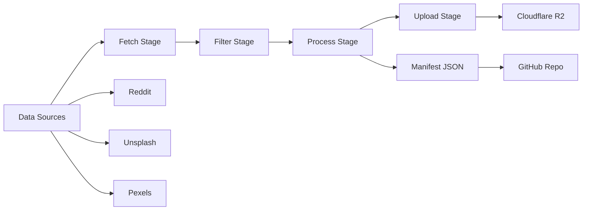

# RAMEN - Refined Automated Media Embedding Network

[](https://opensource.org/licenses/MIT)
[](https://www.python.org/downloads/)

**RAMEN** is an automated wallpaper curation pipeline that builds a premium collection of 10,000-15,000 exceptional wallpapers with 4-model embeddings and rich metadata. Fully automated via GitHub Actions and stored on Cloudflare R2.

## 🎯 Mission

Build a world-class wallpaper dataset with best-in-class embeddings and the richest metadata, enabling superior recommendations for the [Vanderwaals](https://github.com/yourusername/vanderwaals) wallpaper app.

**Quality over quantity**: No fixed quotas. Accept only wallpapers scoring ≥0.85 (adjustable based on collection maturity).

## ✨ Features

### 🤖 Fully Automated Pipeline
- **Daily curation** via GitHub Actions (runs at 2 AM IST)
- **Zero manual work** except weekly reviews
- **Smart source optimization** based on acceptance rates
- **Automatic deduplication** using perceptual hashing

### 🧠 4-Model Embedding System (V2 Stack)
- **MobileNetV4-Small** (960D): Device compatibility with 576D legacy projection
- **EfficientNetV2-Large** (1,280D): Visual similarity and aesthetic quality
- **SigLIP 2 Large** (1,152D): Semantic understanding and text search
- **DINOv3-Large** (1,024D): Scene composition and spatial relationships

### 📊 Premium Metadata (20+ Fields)
- 5-color palettes (LAB color space)
- AI-generated scene analysis and categorization
- Composition metrics (rule of thirds, symmetry, depth)
- Aesthetic properties (mood, style, quality tier)
- Full attribution and licensing information

### 💎 Quality Standards
- **Minimum resolution**: 1920×1080 or equivalent (supports portrait for mobile)
- **Uniqueness**: <85% perceptual hash similarity
- **Text coverage**: <30% (rejects screenshots)
- **Quality score**: ≥0.85 threshold (adjusts by collection phase)

## 🏗️ Architecture



### Data Sources
- **Reddit (60%)**: r/wallpapers, r/EarthPorn, r/Amoledbackgrounds, r/MinimalWallpaper, r/CityPorn
- **Stock Photography (25%)**: Unsplash, Pexels curated collections
- **Community (15%)**: Manual curation and submissions

### Daily Pipeline (30-40 minutes)
1. **Fetch** (5-8 min): Download 150-200 candidates from APIs
2. **Filter** (8-12 min): Resolution, deduplication, text detection, preliminary scoring
3. **Process** (15-20 min): Extract embeddings, generate metadata, final scoring
4. **Upload** (3-5 min): Batch upload to R2, update manifest
5. **Report** (2 min): Generate statistics and alerts

## 🚀 Getting Started

### Prerequisites
- Python 3.10 or higher
- API keys for Reddit, Unsplash, and Pexels
- Cloudflare R2 account (optional for local testing)
- Tesseract OCR (optional, for text detection)

### Installation

1. **Clone the repository**
```bash
git clone https://github.com/yourusername/RAMEN.git
cd RAMEN
```

2. **Install dependencies**
```bash
pip install -r requirements.txt
```

3. **Install Tesseract OCR** (optional)
```bash
# macOS
brew install tesseract

# Ubuntu/Debian
sudo apt install tesseract-ocr
```

### Configuration

1. **Copy and configure environment variables**
```bash
cp .env.example .env
```

2. **Edit `.env` with your API credentials**
```bash
# Reddit API
# Reddit API (No API keys needed)
REDDIT_USER_AGENT=platform:app_name:version (by /u/username)

# Stock Photo APIs
UNSPLASH_ACCESS_KEY=your_unsplash_key
PEXELS_API_KEY=your_pexels_key

# Cloudflare R2 Storage
R2_ENDPOINT=https://account_id.r2.cloudflarestorage.com
R2_ACCESS_KEY=your_r2_access_key
R2_SECRET_KEY=your_r2_secret_key
R2_BUCKET_NAME=your_bucket_name
R2_CUSTOM_DOMAIN=wallpapers.yourdomain.com  # Optional: custom domain
```

3. **Customize pipeline settings** (optional)
```bash
# Edit config.yaml to adjust quality thresholds, source allocations, etc.
nano config.yaml
```

### Usage

#### Run the Complete Pipeline
```bash
python pipeline_complete.py --config config.yaml
```

#### Run Individual Stages
```bash
# Fetch candidates only
python curate_wallpapers.py

# Filter and score
python pipeline_part2.py

# Validate collection
python validate_collection.py --manifest manifests/latest.json
```

#### Benchmark Performance
```bash
python benchmark.py --iterations 10
```

## 📁 Project Structure

```
RAMEN/
├── .github/
│   ├── workflows/
│   │   ├── daily-curation.yml    # Main automation workflow
│   │   └── smoke-test.yml        # Weekly validation
│   └── SECRETS.md                # GitHub secrets documentation
├── curate_wallpapers.py          # Stage 1: Fetching
├── filters.py                    # Hard filters (resolution, text, etc.)
├── quality_scorer.py             # Quality scoring system
├── embeddings.py                 # 4-model embedding extraction
├── metadata_generator.py         # Metadata generation
├── r2_storage.py                 # Cloudflare R2 integration
├── manifest_manager.py           # Manifest JSON management
├── pipeline_complete.py          # Complete pipeline orchestration
├── pipeline_robustness.py        # Error handling and recovery
├── validate_collection.py        # Collection validation tool
├── benchmark.py                  # Performance benchmarking
├── config.yaml                   # Pipeline configuration
├── config_loader.py              # Configuration management
├── requirements.txt              # Python dependencies
└── README.md                     # This file
```

## 🔧 GitHub Actions Setup

### Required Secrets

Configure these in **Settings → Secrets and variables → Actions**:

| Secret | Description |
|--------|-------------|
| `REDDIT_USER_AGENT` | User agent string (optional/default provided) |
| `UNSPLASH_ACCESS_KEY` | Unsplash API access key |
| `PEXELS_API_KEY` | Pexels API key |
| `R2_ENDPOINT` | R2 bucket endpoint URL |
| `R2_ACCESS_KEY` | R2 access key ID |
| `R2_SECRET_KEY` | R2 secret access key |
| `R2_BUCKET_NAME` | R2 bucket name |
| `R2_CUSTOM_DOMAIN` | Custom domain for R2 CDN (optional) |
| `PERSONAL_GITHUB_TOKEN` | PAT with repo write access |

See [`.github/SECRETS.md`](.github/SECRETS.md) for detailed setup instructions.

### Workflows

- **Daily Curation** (`daily-curation.yml`): Runs daily at 2 AM IST
- **Smoke Test** (`smoke-test.yml`): Weekly validation on Sundays

## 📊 Success Metrics

### Collection Health
- Average quality score: ≥0.86
- Category balance: No category >35% or <5%
- Diversity score: Embeddings spread across space

### Technical Performance
- GitHub Actions success rate: 95%+
- Average processing time: 30-40 minutes
- R2 upload success rate: 100%
- Metadata completeness: Zero missing fields

## 💰 Cost Efficiency

**Total infrastructure**: Under $20/year

- **Cloudflare R2**: $0.75/month for 10,000 wallpapers
- **GitHub Actions**: Free tier (2,000 minutes/month)
- **jsDelivr CDN**: Free for manifest delivery

## 🗺️ Roadmap

### Phase 1: Foundation (Months 1-3)
- Target: 1,500-2,000 wallpapers
- Threshold: 0.82
- Focus: Validate pipeline, tune filters

### Phase 2: Expansion (Months 4-6)
- Target: 5,000 wallpapers
- Threshold: 0.85
- Focus: Add specialized sources, scale up

### Phase 3: Maturity (Months 7-12)
- Target: 8,000-10,000 wallpapers
- Threshold: 0.87
- Focus: Quarterly rotation, text search

### Phase 4: Living Collection (Year 2+)
- Target: 10,000-15,000 maintained
- Threshold: 0.90
- Focus: Community-driven, replace low-performers

## 🤝 Contributing

Contributions are welcome! Please see [CONTRIBUTING.md](CONTRIBUTING.md) for guidelines.

## 📄 License

This project is licensed under the MIT License - see the [LICENSE](LICENSE) file for details.

## 🙏 Acknowledgments

- Wallpaper sources: Reddit communities, Unsplash, Pexels
- ML models: TensorFlow, PyTorch, Hugging Face
- Infrastructure: GitHub Actions, Cloudflare R2

## 📞 Contact

- **Issues**: [GitHub Issues](https://github.com/yourusername/RAMEN/issues)
- **Discussions**: [GitHub Discussions](https://github.com/yourusername/RAMEN/discussions)

---

**Quality is the strategy. Everything else is just execution.**
